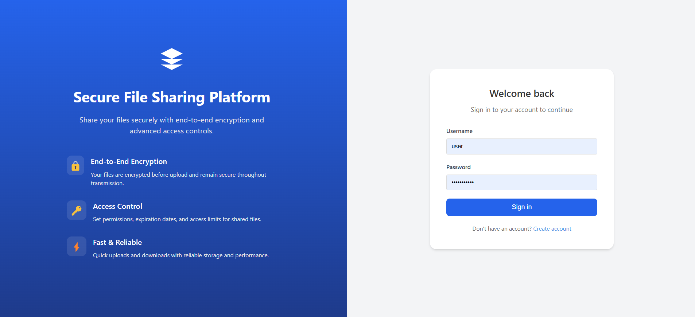
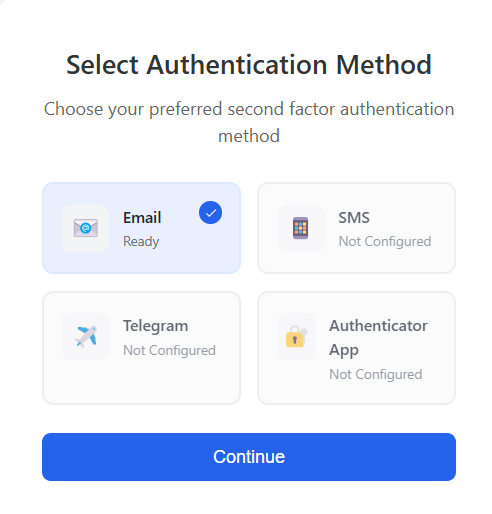
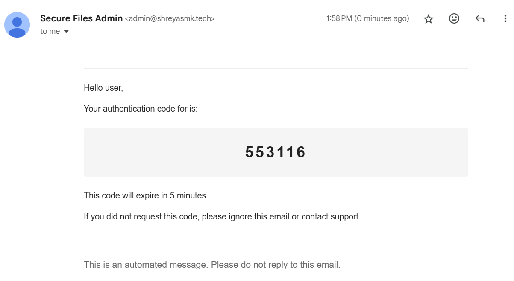
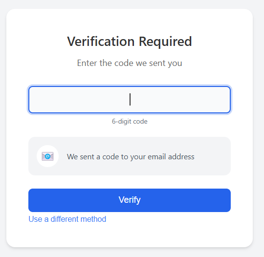
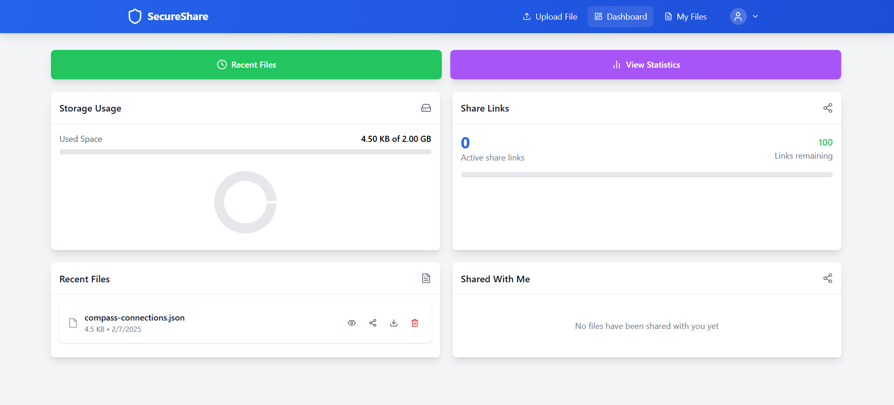

# Secure File Sharing Platform

A secure file sharing platform built with Django, React, and Keycloak, featuring end-to-end encryption and advanced access controls.

Development Acknowledgment

This project was developed with approximately 95% of the codebase being generated through AI assistance, primarily using Anthropic's Claude. This approach enabled rapid development while maintaining code quality and security standards. The AI assistance was particularly valuable in:

- Architecture design
- Code generation
- Security implementation
- Documentation
- Bug fixing and optimization

Human oversight and validation were maintained throughout the development process to ensure code quality.

Features

- 🔒 End-to-end file encryption
- 🔑 Role-based authentication with Keycloak
- 👥 User role management (Admin/User)
- 🔗 Secure file sharing with expiry
- 📊 File access analytics
- 🛡️ Advanced access controls

Prerequisites

- Docker and Docker Compose
- Windows/Linux/MacOS
- Modern web browser
- Git

Quick Start

1. Clone the repository:

```bash
   git clone https://github.com/shreyasY2k/secure-files
   cd secure-files
```

2. Start the services:

```bash
   docker compose up --build
```

   This command will:

- Build and start all necessary containers
- Generate SSL certificates automatically
- Initialize Keycloak with default realms and users
- Set up the database
- Start the frontend and backend services with SSL enabled

3. Install the SSL certificate:

   For Windows:

   - Navigate to the 'certs' directory in your project folder
   - Double-click localhost.crt
   - Click "Install Certificate"
   - Select "Local Machine"
   - Click "Next"
   - Select "Place all certificates in the following store"
   - Click "Browse" and select "Trusted Root Certification Authorities"
   - Click "Next" and "Finish"
   - Restart your browser

   For Linux/Ubuntu:

   ```bash
   sudo cp certs/localhost.crt /usr/local/share/ca-certificates/
   sudo update-ca-certificates
   ```

   Then restart your browser.
4. Access the services:

   - Frontend UI: https://localhost:8766 🌐
   - Backend API: https://localhost:8766/api 🔌
   - Keycloak Admin Console: https://localhost:8766/auth 🔐

Default Users

The system comes with two pre-configured users:

Admin User 👨‍💼

- Username: admin
- Password: Admin@123456
- Role: admin

Regular User 👤

- Username: user
- Password: User@123456
- Role: user

⚠️ Important: Change these credentials in production!

Keycloak Configuration 🔐

- Admin Username: admin
- Admin Password: CDEWSXZAQ!#
- Admin Console: https://localhost:8766/auth

Features in Detail

User Authentication 🔑

- Keycloak-based authentication
- Role-based access control
- Secure session management

File Sharing 📂

- Secure share links with expiry
- Access count limits
- User-to-user direct sharing

Admin Features ⚙️

- User management
- Access statistics
- System monitoring

Development Components

Backend (Django) 🐍

- REST API with Django REST framework
- SQLite database

Frontend (React) ⚛️

- Vite React
- Tailwind CSS for styling

Security (Keycloak) 🛡️

- OAuth 2.0 / OpenID Connect
- Role-based access control
- TOTP, SMS, Email and Telegram MFA
- Customizable authentication flows

SSL/HTTPS (Nginx + OpenSSL) 🔒

- Automatic SSL certificate generation
- Secure reverse proxy configuration
- Single point SSL termination
- Path-based routing for all services

## Screenshots 📸






Troubleshooting 🔧

Common Issues

1. Docker Image Pull Issues 🐳
   Some base images might fail to pull automatically. If you encounter pull errors, try manually pulling these images first:

   ```bash
   docker pull python:3.9-slim
   docker pull node:18-slim
   docker pull postgres:13
   docker pull quay.io/keycloak/keycloak:24.0.2
   ```

   Then run docker-compose up --build again.
2. Keycloak Connection Issues 🔌

   - Ensure all services are up: docker-compose ps
   - Check Keycloak logs: docker-compose logs keycloak
   - Wait for Keycloak initialization to complete
3. File Upload Issues 📤

   - Check storage permissions
   - Verify file size limits
   - Check backend logs: docker-compose logs backend
4. SSL Certificate Issues 🔒

   - Ensure you've installed the certificate correctly for your OS
   - Clear your browser's SSL state and cache
   - For Windows: Check certificate is installed in "Trusted Root Certification Authorities"
   - For Linux: Verify certificate is in /usr/local/share/ca-certificates/

Contributing 🤝

1. Fork the repository
2. Create a feature branch
3. Commit your changes
4. Push to the branch
5. Create a Pull Request

Support 💬

For issues and feature requests, please use the GitHub issue tracker.
